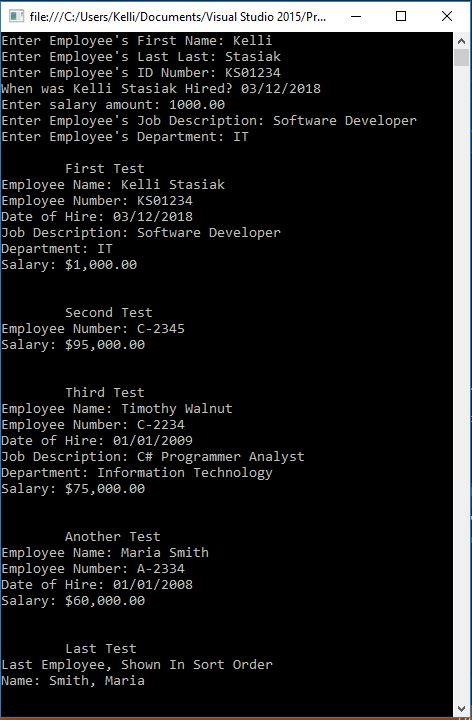

# Employee-App
C# Application

## Assignment Details
Create an Employee class. Items to include as datea members are employee number, first name, last name, date of hire, job description, department, and monthly salary. The class is often used to diplay an alphabetical listing of an employee. Include appropriate constructors and properties. Provide two intace methods that return the full name. The first should return first name, space last name. The second method should return the name in a formate that it could be used for sorting (last name, followed by a comma, space, and then first name). Override ToString() method to return employee1 data member. Create a sond class to test you Employee class.

## Output

